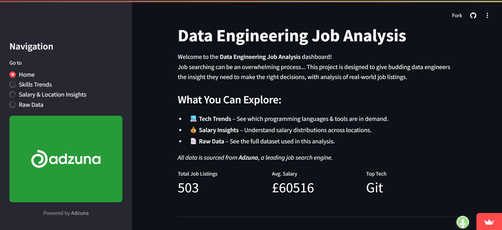

# 📊 Adzuna Job Listings ETL + Dashboard  

<h3 align="center">
  A data engineering and analytics project using Python, Adzuna API, PostgreSQL, and Streamlit.
</h3>

**Live Dashboard**: [View on Streamlit](https://adzuna-pipeline-analysis-lddaeuynvgvzldvkt2jmiv.streamlit.app/)


## 🖼️ Screenshots

| Dashboard Overview | 
|--------------------|
|  | 

| Salary Map | Technology Mentions |
|------------|---------------------|
|  |  


## 🚀 Project Overview

- This project extracts, transforms, and analyses job listing data from the Adzuna API to uncover insights about the UK tech job market. It focuses on identifying in-demand technologies across regions and tracking salary trends.

- It demonstrates end-to-end data engineering: working with external APIs, storing and transforming data in a remote PostgreSQL database, enriching data via geocoding, applying NLP techniques, and presenting insights in a user-friendly dashboard.


## 🧩 Features

- **ETL Pipeline**  
  Extracts from the Adzuna Job Search API and loads data into a PostgreSQL database.

- **Data Cleaning & Standardisation**  
  Cleans and standardises job listing fields in Pandas.  
  Resolves inconsistencies in location data before updating the database.

- **NLP Analysis**  
  Extracts popular technologies and skills from job descriptions and compares them against a defined list of in-demand tech keywords.

- **Geocoding Enrichment**  
  Uses a geocoding API to convert cleaned location names into geographic coordinates, enriching the dataset for mapping and regional analysis.

- **SQL Integration**  
  Uses `psycopg2` to connect to a remote PostgreSQL database.  
  Executes raw SQL in Python to manage inserts, updates, and queries.

- **Streamlit Dashboard**  
  Presents findings and visualisations in an interactive, user-friendly web app.


## 🛠️ Tech Stack

- **Languages**: Python  
- **Libraries**: Pandas, Requests, Regex (`re`), NLTK  
- **Database**: PostgreSQL (remote), accessed via `psycopg2`  
- **APIs**: Adzuna Job Search API, OpenCage Geocoder  
- **Visualisation**: Streamlit, Plotly  
- **Data Storage**: Remote PostgreSQL

## 🏗️ Architecture

```text
[Adzuna API]
     ↓
[ETL Script (Python)]
     ↓
[Pandas Cleaning + Location Standardisation]
     ↓
[Geocoding API Enrichment]
     ↓
[Remote PostgreSQL Database (via psycopg2 + raw SQL)]
     ↓
[Streamlit Dashboard]
```


## 💡 Future Improvements
- Fully automate the pipeline using orchestration tools like Apache Airflow to schedule regular updates.

- Add unit and integration tests to validate the functionality of the ETL pipeline, database interactions, and API responses.

- Incorporate CI/CD using GitHub Actions or GitLab CI to automatically lint, test, and deploy code changes on each commit.

## How to Run 

This step is optional — most users can explore the project via the screenshots and dashboard demo.

```bash
# 1. Clone the repo
git clone https://github.com/yourusername/adzuna-job-pipeline.git

# 2. Install dependencies
pip install -r requirements.txt

# 3. Set up .env with:
- Adzuna API credentials
- Geocode API key (optional)
- PostgreSQL DB connection string

# 4. Run the ETL pipeline
python extraction/run_extraction.py

# 5. Launch the dashboard
streamlit run app/app.py
```
